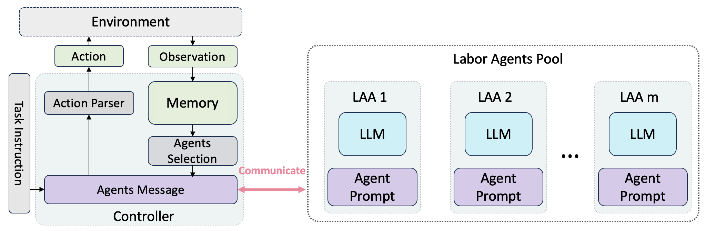
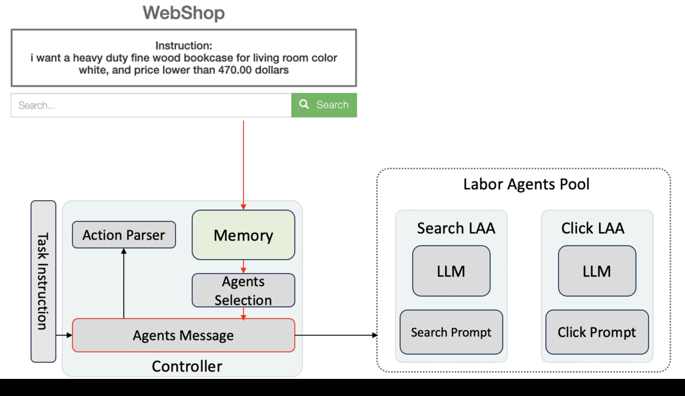
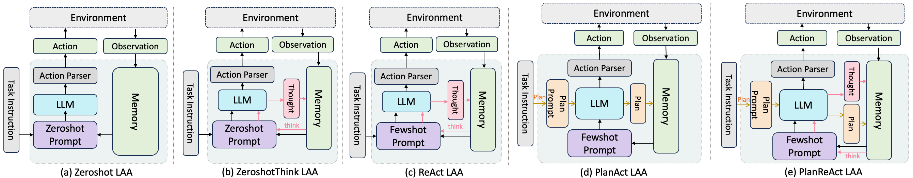
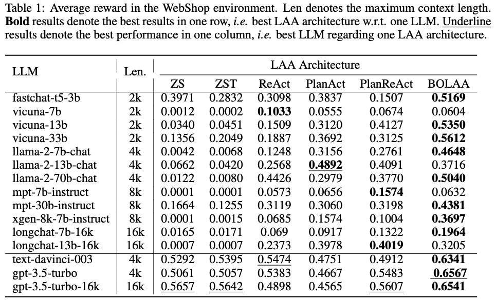
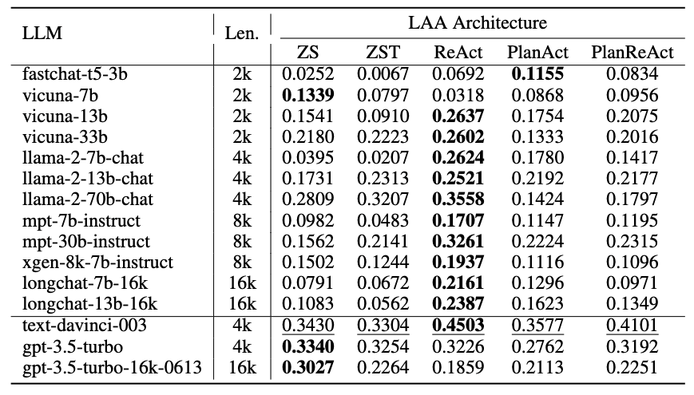

# BOLAA: Benchmarking and Orchestrating LLM-augmented Autonomous Agents

## News
- [Aug. 2023] Initial Release of [BOLAA paper](https://arxiv.org/abs/2308.05960) and implementation code! 

## Introduction
This is the repo for [BOLAA paper](https://arxiv.org/abs/2308.05960). 
In this paper, we create benchmark on LLM-augmented Autonoumous Agents (LAA).
We compare 6 different LAA architecture, including 5 existing intuitions and 1 new BOLAA agent. 
And all those agents are paired with different LLMs to compare the performance.
BOLAA  is able to communicate and orchestrate multiple specialitist agents:

We tested on two types of enviroments: the webshop navigation  environment, and HotPotQA enviroment.
An example of the BOLAA web agent simulation on webshop enviroment is:


Besides BOLAA arch, we also devise five standard LAA arches, the Zeroshot (ZS), Zeroshot-Think (ZST), ReAct, PlanAct, PlanReAct as follows:


## Installation
1. Setup the [fastchat](https://github.com/lm-sys/FastChat) to use local open-source LLMs. Go to next step if you only test openai API.
2. Setup OPENAI API KEY in both [webrun/config](./web_run/config.py) and [hotpotqa_run/config](./hotpotqa_run/config.py). Skip this if you only test open-source LLMs.  
2. Setup the [webshop environment](./webshop/) if you are testing web agent
3. Setup the agent_benchmarking environment as follows:
```
conda create -n agent_benchmark python=3.10 -y
conda activate agent_benchmark
pip install -r requirements.txt
```
## Web Agent Simulation
```
python run_webagent.py --agent_name Search_Click_Control_Webrun_Agent --llm_name gpt-3.5-turbo --max_context_len 4000
```
other agent options can be found in [test_webagent.sh](./test_webagent.sh). The implementation code for various web agents is in [web_run](./web_run/agent_arch.py)



## HotpotQA Agent Simulation
```
python run_hotpotqaagent.py --agent_name React_HotPotQA_run_Agent --llm_name gpt-3.5-turbo --max_context_len 4000
```
other agent options commands can be found in [test_hotpotqa.sh](./test_hotpotqa.sh). The implementation code for various web agents is in [hotpotqa_run](./hotpotqa_run/agent_arch.py)


## Citation
If you find our paper or code useful, please cite
```
@misc{liu2023bolaa,
      title={BOLAA: Benchmarking and Orchestrating LLM-augmented Autonomous Agents}, 
      author={Zhiwei Liu and Weiran Yao and Jianguo Zhang and Le Xue and Shelby Heinecke and Rithesh Murthy and Yihao Feng and Zeyuan Chen and Juan Carlos Niebles and Devansh Arpit and Ran Xu and Phil Mui and Huan Wang and Caiming Xiong and Silvio Savarese},
      year={2023},
      eprint={2308.05960},
      archivePrefix={arXiv},
      primaryClass={cs.AI}
}
```

## Acknowledge
- Part of our environment code reuse [ReAct](https://github.com/ysymyth/ReAct/tree/master) code. 
- Our LLM API is based on [Langchain](https://github.com/langchain-ai/langchain)
- We use the [WebShop](https://github.com/princeton-nlp/WebShop) and [HotPotQA](https://hotpotqa.github.io/) for testing.
